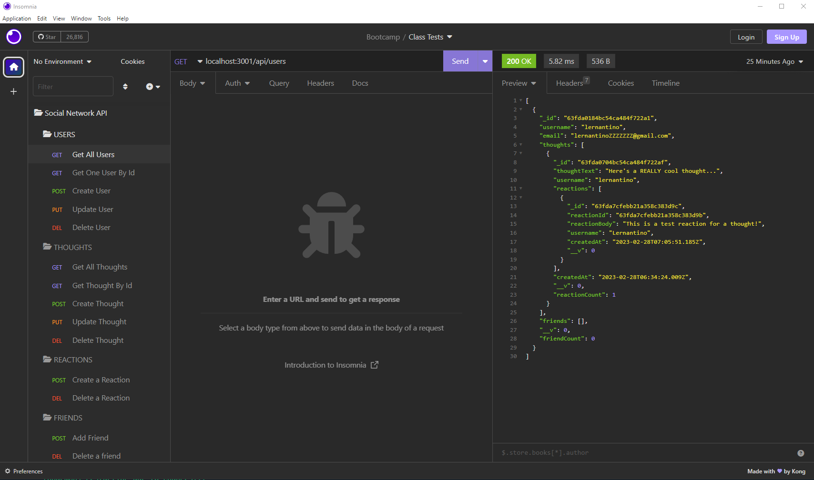

# social-network-api 

## Description

This was a NoSQL/MongoDB class project to create a social network API.  Models include users, thoughts, and reactions with the ability to add and delete friends.  Mongoose is used as the ODM.

In this API, you can:

### Users
- Get all users
- Get a user by ID
- Create a user
- Update a user
- Delete a User

### Thoughts
- Get all thoughts
- Get a thought by ID
- Create a thought
- Update a thought
- Delete a thought

### Reactions
- Create a reaction
- Delete a reaction

### Friends
- Add a friend
- Delete a friend

### BONUS
- When a user is deleted, so are all of their thoughts.

## Table of Contents

- [Installation](#installation)
- [Usage](#usage)
- [License](#license)
- [Questions](#questions)

## Installation

To install copy all files in the root directory.  Run `npm i` to install dependencies, then create endpoint tests in your tool of choice (tested with Insomnia).

## Usage

After creating test routes in your REST client of choice, test routes.  You can view a video walkthrough of the social network API here: https://youtu.be/mBQeJrFSrfU

## License

MIT License - Please refer to the LICENSE in the repo.

## Questions

You can view my Github @ https://www.github.com/maximusDecimalusMeridius  
OR  
Email me with questions @ [andygg_dev@yahoo.com](mailto:andygg_dev@yahoo.com?subject=Question%20About%20social-network-api%20App)
    